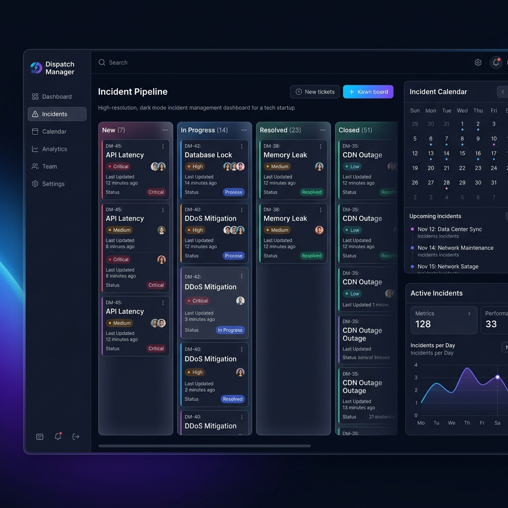

# Dispatch Manager V3.0 🚀

[](https://GitHub.com/Naylm/antigravity_dispatch/graphs/commit-activity)
[](https://GitHub.com/Naylm/antigravity_dispatch/pulls)
[](https://www.docker.com/)



**Dispatch Manager** est une plateforme SaaS de pointe pour la gestion opérationnelle des interventions techniques. Alliant puissance du backend Python et élégance du design moderne, elle transforme la gestion d'incidents en une expérience fluide et collaborative.

## ✨ Pourquoi Dispatch Manager ?

Dans un environnement de support haute-charge, la clarté et la rapidité sont cruciales. Dispatch Manager répond à ces besoins avec :

*   **Vue Kanban Dynamique** : Visualisez l'état de vos tickets en un clin d'œil.
*   **Planification Avancée** : Un calendrier intelligent pour optimiser les tournées des techniciens.
*   **Base de Connaissances Collaborative** : Un Wiki intégré pour capitaliser sur l'expertise technique.
*   **Expérience Premium** : Interface responsive, mode sombre natif, et effets de flou (Glassmorphism).

## 🛠️ Stack Technologique

*   **Core Backend** : Python 3.11+ avec Flask.
*   **Data Layers** : PostgreSQL (Persistance), Redis (Cache & Pub/Sub).
*   **Real-time** : WebSockets via Socket.IO pour une synchronisation instantanée.
*   **Frontend Architecture** : Vanilla JS (ES6), CSS3 Custom Properties, HTML5.
*   **Infrastructure** : Docker, Nginx (Reverse Proxy), Gunicorn (WSGI).

## 🚀 Démarrage Rapide

### Installation avec Docker (Recommandé)

1.  **Cloner le projet**
    ```bash
    git clone https://github.com/Naylm/antigravity_dispatch.git
    cd antigravity_dispatch
    ```

2.  **Configuration**
    Copiez le fichier d'exemple et adaptez les variables si nécessaire :
    ```bash
    cp .env.example .env
    ```

3.  **Lancement**
    ```bash
    docker-compose up -d --build
    ```

L'application est accessible sur [http://localhost](http://localhost).

## 📂 Documentation Complète

Pour approfondir vos connaissances sur le système, consultez les guides détaillés :

*   [Guide de Démarrage Rapide](docs/GUIDE_DEMARRAGE.md)
*   [Architecture & Structure du Projet](docs/PROJECT_STRUCTURE.md)
*   [Guide de Déploiement Production](docs/DEPLOY.md)
*   [Schéma de la Base de Données](docs/DATABASE_SCHEMA.md)

---

Développé par **Naylm** pour une efficacité opérationnelle sans compromis.
